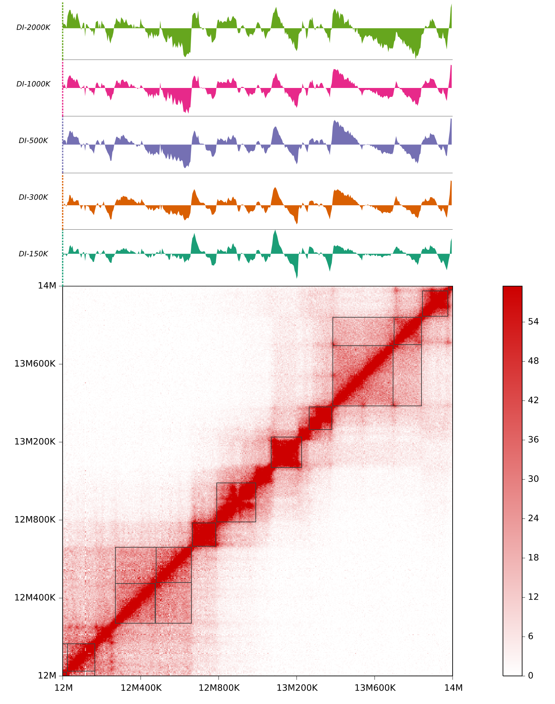
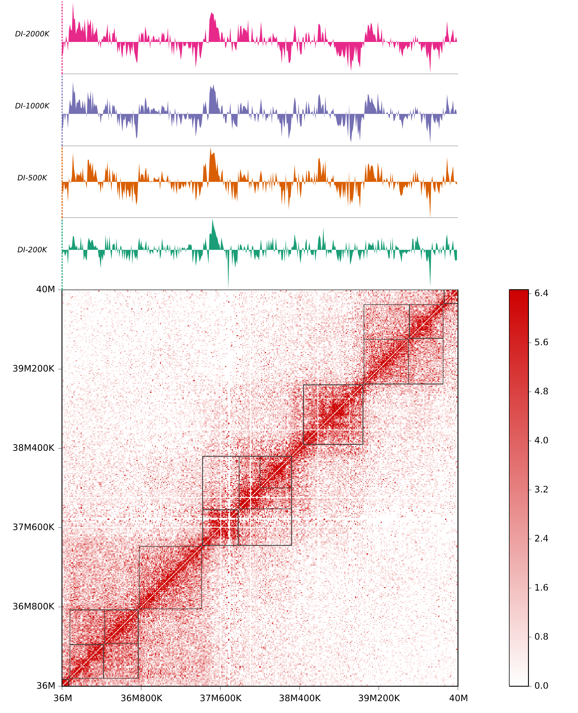

calTADs
*******
.. image:: https://zenodo.org/badge/doi/10.5281/zenodo.59188.svg
   :target: http://dx.doi.org/10.5281/zenodo.59188
   
.. note:: calTADs won't be maintained anymore, if you are interested in hierarchical domain
   detection, I recommend using our recent software, HiTAD. HiTAD is developed as a module
   of our TADLib toolkit which you can get from `here <https://pypi.python.org/pypi/TADLib>`_.

Introduction
============
3C-based techniques(5C, Hi-C) have revealed the existence of topologically
associating domains(TADs), a pervasive sub-megabase scale structure of chromosome.
TADs are contiguous regions in which loci interact much more frequently with
each other than with loci out of the region. Visually, TADs appear as square
blocks along the diagonal on a heatmap.

There are various methods for TAD identification [1]_, [2]_. Most methods
apply a two-step scheme: First, transform TAD or boundary signal into 1d
profile using some statistic(e.g. Directionality Index, DI); Then, use the
1d profile to identify potential boundaries and produce a set of discrete
non-overlapping TADs. However, the organization of chromosome structure is
always intricate and hierarchical. Phillips-Cremins JE et al. [3]_ utilized
a modified DI of multiple scales subdividing TADs into smaller subtopologies (sub-TADs)
using 5C data. Here, I extend their algorithm to the whole genome and develop
this software.

*calTADs* are tested on traditional [4]_ and *in-situ* [5]_ Hi-C data, both generating
reasonable results.

Installation
============
Please check the file "INSTALL.rst" in the distribution.

Links
=====
- `Repository <https://github.com/XiaoTaoWang/calTADs>`_
- `PyPI <https://pypi.python.org/pypi/calTADs>`_

Usage
=====
Open a terminal, type ``calTADs -h`` for help information.

*calTADs* contains a process management system, so you can submit the same
command repeatedly to utilize the parallel power as much as possible. 

Examples
========
A *in-situ* Hi-C region:(resolution: 5K, high data quality)

A traditional Hi-C region:(resolution: 10K, relatively low quality and high noise ratio)

Reference
=========
.. [1] Dixon JR, Selvaraj S, Yue F et al. Topological domains in
   mammalian genomes identified by analysis of chromatin interactions.
   Nature, 2012, 485: 376-380.

.. [2] Sexton T, Yaffe E, Kenigsberg E et al. Three-dimensional folding
   and functional organization principles of the Drosophila genome.
   Cell, 2012, 148: 458-472.

.. [3] Phillips-Cremins JE, Sauria ME, Sanyal A et al. Architectural protein
   subclasses shape 3D organization of genomes during lineage commitment.
   Cell, 2013, 153(6):1281-95.

.. [4] Lieberman-Aiden E, van Berkum NL, Williams L et al. Comprehensive
   mapping of long-range interactions reveals folding principles of the
   human genome. Science, 2009, 326: 289-293.

.. [5] Rao SS, Huntley MH, Durand NC. A 3D map of the human genome at
   kilobase resolution reveals principles of chromatin looping.
   Cell, 2014, 159(7):1665-80.

Citation
========
Xiaotao Wang. (2016). calTADs: A hierarchical domain caller for Hi-C data. Zenodo. `10.5281/zenodo.59188 <http://dx.doi.org/10.5281/zenodo.59188>`_
